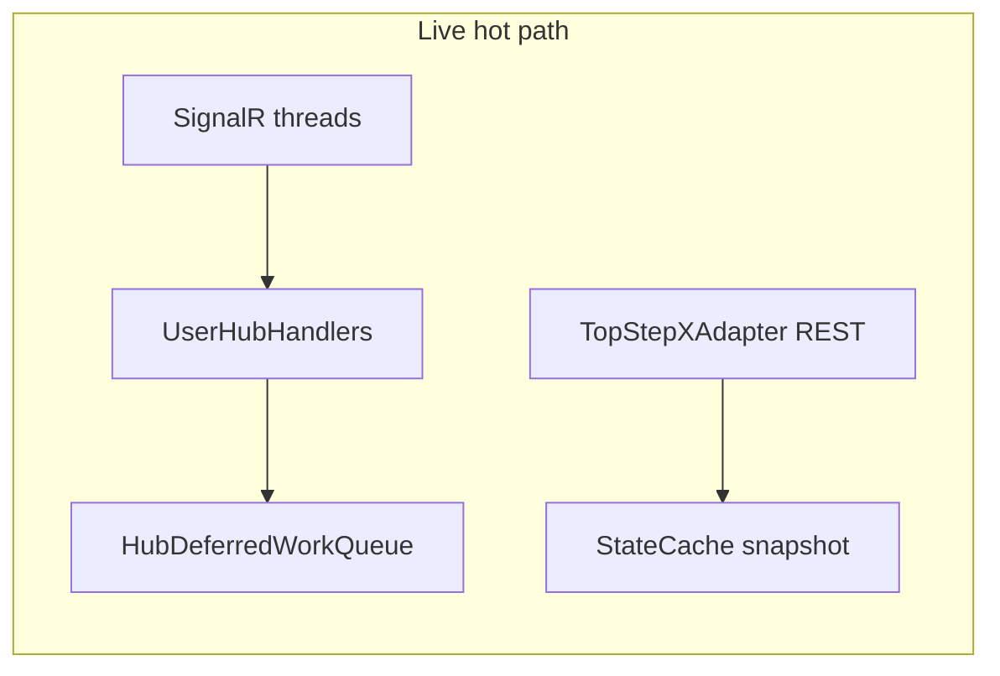
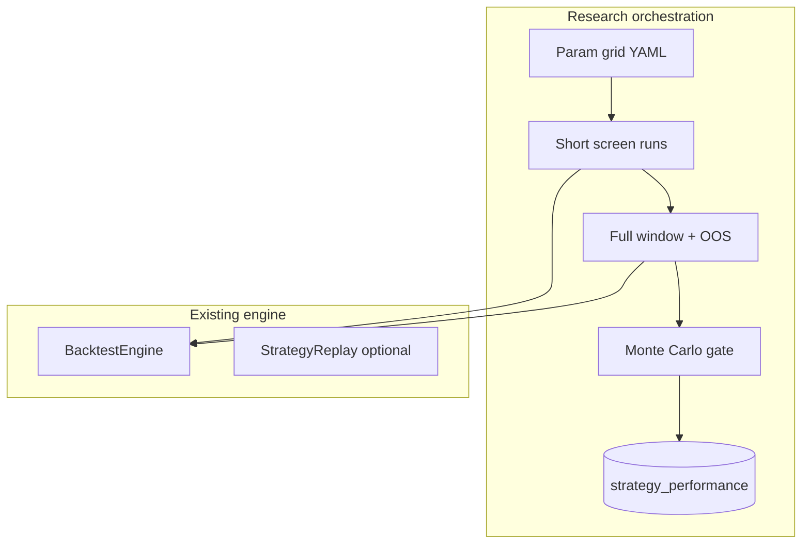

# Live operations + research backtest roadmap

## Current baseline (already in repo)

- **Parallel account snapshot:** [`TopStepXAdapter.get_positions_and_open_orders_parallel`](brokers/topstepx_adapter.py), [`get_positions_and_orders_batch`](trading_bot.py), [`StateCache` snapshot lock](core/state_cache.py).
- **User Hub heavy work:** [`HubDeferredWorkQueue`](core/hub_deferred_queue.py) + refactored [`UserHubHandlers`](core/user_hub_handlers.py); **market** hub still calls sync [`_on_websocket_quote`](trading_bot.py) by design (documented in [README.md](README.md)).
- **uvloop in Docker:** [`Dockerfile`](Dockerfile) sets `ENV USE_UVLOOP=1`; [`core/logging_setup.py`](core/logging_setup.py) installs when allowed.
- **DB:** [`strategy_performance`](infrastructure/database.py) (+ `metadata` JSONB) and async batch writers for metrics / strategy exec / notifications.

---

## Phase A — Fewer broker round-trips (live)

1. **Inventory sequential REST pairs** beyond positions+orders (e.g. dashboard paths that call `get_open_orders` then `get_positions` without `StateCache`; risk/bracket flows in [`trading_bot.py`](trading_bot.py), [`core/risk_management.py`](core/risk_management.py), [`servers/async_webhook_server.py`](servers/async_webhook_server.py)). Route them through existing batch or `asyncio.gather` on the adapter where semantics match.
2. **Contract + history coalescing**
   - Centralize “ensure contracts warm” in one place with a **short in-flight lock** (per process) so concurrent `get_historical_data` / quote subscribe paths do not each trigger [`get_available_contracts`](brokers/topstepx_adapter.py) (see [`trading_bot.py`](trading_bot.py) `create_task` prefetch patterns ~4306).
   - Respect existing TTL in [`ContractManager`](core/market_data.py) / adapter cache; add explicit **stale-while-revalidate** behavior only if API allows (document TopStepX limits in [docs/GOTCHAS.md](docs/GOTCHAS.md) if behavior changes).
3. **API reality check:** TopStepX may not offer a true combined “account snapshot” REST; treat **parallel independent calls** as the ceiling unless docs prove a batch endpoint.

---

## Phase B — Event loop hygiene (live)

1. **AGENTS audit:** `rg` for `time.sleep`, `requests.`, and `run_until_complete` inside `async def` under [`core/`](core/), [`brokers/`](brokers/), [`strategies/`](strategies/).
2. **Market hub (optional later):** Do **not** blindly move [`_on_websocket_quote`](trading_bot.py) to `HubDeferredWorkQueue` (adds latency). If py-spy ever shows **wide** Python stacks there, consider **micro-batching quotes** inside the same thread or **sampling** `event_bus.publish` frequency—not full deferral by default.
3. **Document** “sync quote path” vs “deferred User Hub path” in [docs/perf/OPERATIONS_TUNING.md](docs/perf/OPERATIONS_TUNING.md) (one diagram) so future changes do not regress intent.

---

## Phase C — DB and logging (live)

1. **Hot-path logging:** Second pass on [`brokers/topstepx_adapter.py`](brokers/topstepx_adapter.py) for remaining `logger.info` on read-heavy paths (e.g. trade/order history fetch at ~1336–1535) → `DEBUG` unless operator-facing; keep order lifecycle INFO where useful.
2. **Large JSON:** Enforce [`core/json_fast`](core/json_fast.py) / avoid `json.dumps` on per-tick paths per AGENTS; grep `json.dumps` in [`core/websocket_manager.py`](core/websocket_manager.py), adapter history cache paths.
3. **DB writers:** Confirm every high-frequency writer path uses [`infrastructure/database.py`](infrastructure/database.py) batch APIs; add missing call sites only where profiling shows fsync/CPU on insert.

---

## Phase D — uvloop in prod

1. **Railway / compose:** Verify runtime env does **not** set `USE_UVLOOP=0` / `DISABLE_UVLOOP=1` ([`load_env.py`](load_env.py), platform env).
2. **Startup proof:** One `INFO` line from [`configure_logging`](core/logging_setup.py) when uvloop installs (already logs on success); document in [docs/PLAYBOOK.md](docs/PLAYBOOK.md) “check log for uvloop” for deploy smoke.

---

## Phase E — Backtest “research” layer (new code, thin)

Treat [`core/backtest`](core/backtest/) + [`BacktestEngine`](core/backtest/engine.py) as **execution**; add **`core/research/`** (or `scripts/research_grid.py`) as orchestration only.

| Building block | Approach |
|----------------|----------|
| **Parameter grid** | CLI: `--param-grid key=min:max:step` or YAML manifest; loops `backtest_executor.run_backtest` with merged TOML overrides via [`StrategyConfig`](core/strategy_config.py) / dict merge. |
| **Walk-forward / OOS** | Calendar splits: `train_end`, `test_start`; require **minimum** test window; fail if in-sample metrics passed without OOS block. |
| **Costs / realism** | Centralize slippage/commission/session flags in one `ResearchRunConfig` dataclass passed into engine; default **conservative**; emit **sensitivity table** (e.g. slippage ±50%) in Markdown/JSON artifact. |
| **Robustness gate** | After run, call existing [`MonteCarloSimulator`](core/backtest/monte_carlo.py) / bootstrap on trade list; **promotion rule**: e.g. MC profit prob > threshold AND max DD below cap. |
| **Live alignment** | Document + optional **assert** same bar timezone and contract resolution path as live ([`Bar`](core/interfaces/market_data_interface.py), adapter); add one integration test: load TOML + synthetic bars through same `StrategyConfig` as executor smoke. |
| **Screening + Postgres** | Stage 1: small `--days` / few symbols → score; survivors → full window. Persist to `strategy_performance.metadata`: `{ git_sha, toml_hash, run_tag, is_oos, grid_id, mc_summary }` (no migration required initially; add columns later if query-heavy). |
| **Overfitting discipline** | Cap grid size in CLI; require `--git-sha` / auto `subprocess` capture; store `config/strategies/<name>.toml` hash in metadata. |

**Deliverables:** `core/research/runner.py` (or extend [`core/backtest_executor.py`](core/backtest_executor.py) with `--research-spec` file), `docs/BACKTEST_RESEARCH.md`, optional `scripts/research_screen.sh`, pytest for split + MC gate on toy trades.

---

## Suggested order of execution

1. **A + C** (measurable latency / disk I/O, low architectural risk).  
2. **D** (quick env + doc verification).  
3. **B** (targeted only if py-spy shows app stacks under load).  
4. **E** (largest new surface; ship MVP: grid + OOS + metadata persistence + MC gate, then iterate walk-forward and sensitivity tables).
