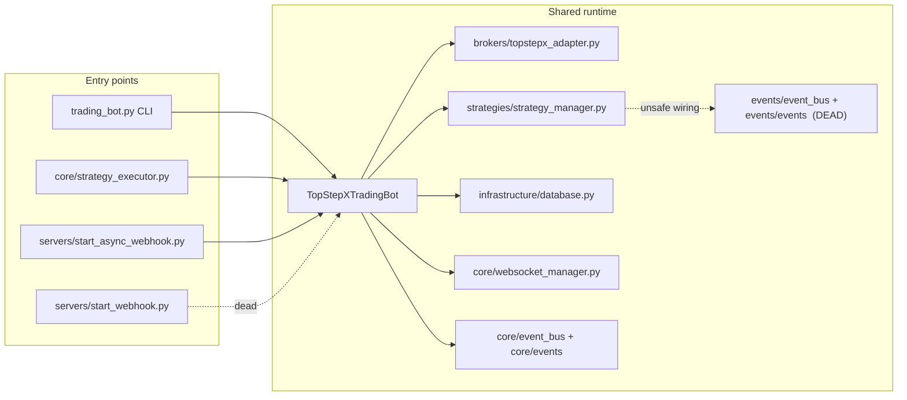

## TopStepX TradeBotServer — Infrastructure & Performance Cleanup Plan

### Audit summary (what's actually in the repo)

- Repo is largely Python with one ~10.5K-line god module ([trading_bot.py](trading_bot.py)) plus a ~5.5K-line broker adapter ([brokers/topstepx_adapter.py](brokers/topstepx_adapter.py)) and a ~6.3K-line GUI module ([gui/chart_html.py](gui/chart_html.py)).
- Production deploy is `python3 servers/start_async_webhook.py` ([Procfile](Procfile), [railway.json](railway.json), [Dockerfile](Dockerfile)).
- Local strategy ops use `python core/strategy_executor.py` ([scripts/run_overnight.sh](scripts/run_overnight.sh), [scripts/start_all.sh](scripts/start_all.sh), [scripts/restart_all_strategies.sh](scripts/restart_all_strategies.sh)).
- 96 markdown files in `docs/` (many are dated "fix summary" duplicates), 50 files in `tests/` (entire `tests/` is `.gitignore`d), 3 `.env.*` backups in repo root, `rust/target/` build artifacts checked into git.
- Two parallel event-bus stacks live side-by-side: [core/event_bus.py](core/event_bus.py) + [core/events.py](core/events.py) vs [events/event_bus.py](events/event_bus.py) + [events/events.py](events/events.py). They have **incompatible** `Event` shapes (`event.type` vs `event.event_type`, `order_placed` vs `order.placed`).



---

### Phase 1 — Infrastructure: delete dead paths & fix broken plumbing

Goal: collapse the runtime to one entrypoint per responsibility. All deletions go straight to git (git history is the archive).

1. **Fix the production Docker build first** (currently broken; image cannot build).
    - [Dockerfile](Dockerfile) lines 18–27 reference a `frontend/` directory that does not exist. Either:
        - (a) Restore the React SPA into a `frontend/` directory (if there's a separate repo for it), **or**
        - (b) Strip the Node/npm stages and serve the existing pre-built [static/dashboard/](static/dashboard/) only.
    - Recommend (b): drop `apt-get nodejs`, the `COPY frontend/...`, the `npm` lines, and reduce the image. ([scripts/build.sh](scripts/build.sh) needs the same treatment.)

2. **Resolve the event-bus collision (HIGH severity bug magnet).**
    - [core/order_execution.py:13](core/order_execution.py) imports `EventBus`, `OrderEvent`, `EventType` from the `events` package, but [trading_bot.py:428](trading_bot.py) injects a `core.event_bus.EventBus` instance (different `Event` shape — `event.type` vs `event.event_type`).
    - Pick the `core/` stack as canonical (it's the one wired into `trading_bot`, GUI, and chart code) and **delete the `events/` package entirely** ([events/event_bus.py](events/event_bus.py), [events/events.py](events/events.py), [events/__init__.py](events/__init__.py)).
    - Migrate [core/order_execution.py](core/order_execution.py) imports to `from core.event_bus import EventBus` and `from core.events import Event, EventType`. Add an `OrderEvent` constructor helper in [core/events.py](core/events.py) if downstream code needs the payload shape.

3. **Delete superseded modules.**
    - [servers/webhook_server.py](servers/webhook_server.py) (3,123 lines, sync `http.server` legacy) — not referenced by Procfile/Dockerfile/railway.json. Delete.
    - [servers/start_webhook.py](servers/start_webhook.py) — sync webhook entrypoint, only consumer of the file above. Delete.
    - [core/backtesting_engine.py](core/backtesting_engine.py) (487 lines) — zero imports anywhere; superseded by [core/backtest/engine.py](core/backtest/engine.py). Delete.
    - [core/strategy_cache.py](core/strategy_cache.py) (213 lines) — `StrategyCache` and decorators have **no callers** anywhere; overlaps with [core/state_cache.py](core/state_cache.py). Delete.
    - [gui/chart_html_fixed.py](gui/chart_html_fixed.py) — orphan, not imported. Delete.
    - [gui/chart_window.py](gui/chart_window.py) — `open_chart_window` only self-referenced. Delete.
    - In-file dedupe: remove the second `RateLimiter` class in [trading_bot.py:142-203](trading_bot.py) (the file already imports `core.rate_limiter`).

4. **Purge git-tracked artifacts and secrets.**
    - Remove `rust/target/` from git tracking (`git rm -r --cached rust/target` + add `rust/target/` to [.gitignore](.gitignore); confirm via `git ls-files rust/target | wc -l`).
    - Delete `.env.bak`, `.env.backup.20260209_202831`, and **especially `.env.clean`** (contains plaintext API keys, JWTs, DB URL with password, Discord tokens). Rotate any credentials that lived in `.env.clean`.
    - Verify [.gitignore:99](.gitignore) `tests/` entry — the entire `tests/` directory is gitignored. Either un-ignore it (so tests run in CI) or delete the local test scaffolding. Recommend un-ignore + commit a curated subset.

5. **Fix machine-specific scripts.**
    - [scripts/restart_all_strategies.sh:5](scripts/restart_all_strategies.sh) `cd /Users/knealy/tradeBotServer` — replace with `cd "$(dirname "$0")/.."`.
    - [scripts/rebuild_rust.sh:6](scripts/rebuild_rust.sh) — same fix.
    - [scripts/start_all.sh:23-24](scripts/start_all.sh) and [scripts/stop_all.sh:23](scripts/stop_all.sh) reference `core/order_monitor.py` which doesn't exist — remove those comments/lines.
    - [scripts/RESTART_STRATEGIES.sh](scripts/RESTART_STRATEGIES.sh) just prints commands; either make it executable or merge into `restart_all_strategies.sh`. Recommend delete.
    - [scripts/DISABLE_RUST_HOTPATH.sh](scripts/DISABLE_RUST_HOTPATH.sh) actually toggles `TOPSTEPX_USE_RUST` ([trading_bot.py:386-397](trading_bot.py)) — rename to `toggle_rust.sh` and accept on/off arg.

6. **Centralize logging configuration.**
    - 7+ files call `logging.basicConfig` independently ([trading_bot.py:123](trading_bot.py), [core/strategy_executor.py:46](core/strategy_executor.py), [scripts/monitor_positions.py](scripts/monitor_positions.py), [servers/dashboard_api_server.py](servers/dashboard_api_server.py), [servers/start_async_webhook.py:28](servers/start_async_webhook.py), [core/backtest_executor.py:998](core/backtest_executor.py), [scripts/disable_strategies.py](scripts/disable_strategies.py)).
    - Create `core/logging_setup.py` with one `configure_logging(log_file=..., level=...)` function using a `RotatingFileHandler` (10MB × 5 backups) and a stdout handler at WARNING. Every entry point calls it once at the top.
    - Default log level: file=INFO, console=WARNING. `LOG_LEVEL` env var still overrides.

7. **Slim `.env`; move strategy params to per-strategy TOML config files.**
    - The current [.env.example](.env.example) defines ~80 vars; ~40 of them are per-strategy knobs (`OVERNIGHT_*`, `ATR_*`, `BREAKEVEN_*`, `BREAKOUT_*`, `USE_RANGE_PCT_SLTP`, `STOP_RANGE_PCT`, `TP_RANGE_PCT`, `RANGE_BREAK_OFFSET`, `OVERNIGHT_FILTER_*`, `OVERNIGHT_RANGE_*`, `STRATEGY_QUANTITY`, etc.). They mutate frequently and bloat the env file. The audit found 80+ `os.getenv(...)` calls inside [strategies/overnight_range_strategy.py](strategies/overnight_range_strategy.py) alone.
    - Move strategy parameters into TOML files (Python 3.11+ stdlib `tomllib`; Dockerfile pins 3.12, no new dep).
    - New layout:
        - `config/strategies/_schema.toml` — fully documented template
        - `config/strategies/overnight_range.toml`
        - `config/strategies/mean_reversion.toml`
        - `config/strategies/trend_following.toml`
        - `config/strategies/simple_candle.toml`
        - `config/strategies/simple_momentum.toml`
        - `config/strategies/trend_scalping.toml`
        - `config/strategies/README.md` — edit/reload workflow
    - Each TOML file is grouped by intent:
        ```toml
        [meta]
        enabled = true
        symbols = ["MNQ", "MES", "MGC"]

        [timing]
        overnight_start = "18:00"
        overnight_end   = "18:15"
        market_open     = "18:15"
        zone_anchor     = "18:15"

        [risk]
        position_size      = 1
        max_positions      = 2
        max_daily_trades   = 4
        respect_dll        = true
        respect_mll        = true
        max_dll_usage      = 0.75

        [signal]
        atr_period           = 14
        atr_timeframe        = "15m"
        stop_atr_multiplier  = 1.25
        tp_atr_multiplier    = 1.5
        use_range_pct_sltp   = false
        stop_range_pct       = 50.0
        tp_range_pct         = 100.0

        [position_management]
        breakeven_enabled        = true
        breakeven_profit_points  = 15.0
        range_break_offset       = 0.25
        use_dynamic_atr_for_orders = true

        [filters]
        range_size     = false
        gap            = false
        volatility     = false
        dll_proximity  = false
        range_min_pts  = 50.0
        range_max_pts  = 500.0
        gap_max_pts    = 200.0
        atr_min        = 20.0
        atr_max        = 200.0
        dll_threshold_pct = 0.75

        [symbols.MNQ]   # per-symbol overrides
        position_size = 3

        [symbols.MGC]
        position_size = 2
        ```
    - Add `core/strategy_config.py`:
        - `load_strategy_config(name: str, *, env_overrides: bool = True, cli_overrides: dict | None = None) -> StrategyConfig` (a `@dataclass` per strategy: `OvernightRangeConfig`, `MeanReversionConfig`, etc.).
        - **Precedence (highest → lowest)**: CLI args → env vars → TOML file → strategy class default.
        - Validate via dataclass + simple type coercion; fail loud on schema mismatch.
        - Optional cheap hot-reload: poll `os.path.getmtime` per strategy loop iteration; on change, re-parse + emit `EventType.STRATEGY_CONFIG_RELOADED`.
    - Refactor [strategies/strategy_base.py](strategies/strategy_base.py): `BaseStrategy.__init__(self, config: StrategyConfig)`. Remove direct `os.getenv(...)` calls inside any `strategies/*.py` (audit-flagged hotspots: [strategies/overnight_range_strategy.py:40](strategies/overnight_range_strategy.py), [strategies/strategy_manager.py:15](strategies/strategy_manager.py), [strategies/trend_scalping_strategy.py:7](strategies/trend_scalping_strategy.py), [strategies/trend_following_strategy.py:10](strategies/trend_following_strategy.py), [strategies/simple_candle_strategy.py:1](strategies/simple_candle_strategy.py), [strategies/mean_reversion_strategy.py:10](strategies/mean_reversion_strategy.py)).
    - Update [scripts/run_overnight.sh](scripts/run_overnight.sh) and [core/strategy_executor.py](core/strategy_executor.py) to accept `--config=<path>` (defaults to `config/strategies/<name>.toml`).
    - Rewrite [.env.example](.env.example) to keep ONLY:
        - **Secrets**: `PROJECT_X_API_KEY`, `PROJECT_X_USERNAME`, `PROJECT_X_ACCOUNT_ID`, `JWT_TOKEN`, `DATABASE_URL`, `DISCORD_WEBHOOK_URL`, `DISCORD_BOT_TOKEN`, `DISCORD_COMMAND_*`.
        - **Infra**: `LOG_LEVEL`, `STRATEGY_TIMEZONE`, `API_TIMEOUT`, `API_RATE_LIMIT_*`, `RUST_HTTP_TIMEOUT_SECONDS`, `TOPSTEPX_USE_RUST`, `WEBSOCKET_POOL_MAX_SIZE`, `ENABLE_SIGNALR`, `HEALTH_CHECK_*`, `PREFETCH_*`, `CACHE_*`.
        - **Account-wide risk** (cross-strategy): `INITIAL_BALANCE`, `DAILY_LOSS_LIMIT`, `MAXIMUM_LOSS_LIMIT`, `GLOBAL_MAX_POSITIONS`, `MAX_CONCURRENT_STRATEGIES`.
    - Target final size: **`.env` < 40 lines** (down from ~160 in `.env.example`).
    - Optional: support per-account profile via `config/accounts/<account_num>.toml` so account 3 can run with a different `position_size` than account 1 without env shuffling.

---

### Phase 2 — Performance & noise reduction (high-output / low-noise)

1. **Async/sync I/O bug fixes (real latency wins).**
    - [core/auth.py:179-221, 311-338, 434-454, 476-505](core/auth.py): `async def authenticate / ensure_valid_token / list_accounts` all call sync `requests.post` and use `time.sleep(backoff)` on 429. Switch to `aiohttp.ClientSession` (already a project dep) and `await asyncio.sleep`.
    - [core/discord_notifier.py:88-92, 123, 173](core/discord_notifier.py): every method uses `requests.post`. Either (a) use `aiohttp` like above, or (b) wrap each call in `asyncio.to_thread(...)`. Recommend (a).
    - [trading_bot.py:1329-1330](trading_bot.py) and [trading_bot.py:605, 4589, 5916, 6095, 6111](trading_bot.py): `time.sleep` in code reachable from the async loop. Replace with `await asyncio.sleep` (and propagate `async` where missing).

2. **Reduce log volume by ~70%.**
    - [trading_bot.py:2623-2673](trading_bot.py): "EMERGENCY DEBUG" `json.dumps(payload, indent=2)` at INFO on every order — drop to DEBUG or remove.
    - [brokers/topstepx_adapter.py:412](brokers/topstepx_adapter.py): full payload dump on every order; same treatment.
    - [core/bar_aggregator.py:148-205](core/bar_aggregator.py): "first 5 broadcasts log INFO with full OHLC" — gate behind a `BAR_AGG_DEBUG` env var.
    - [core/websocket_manager.py:623-634](core/websocket_manager.py): per-symbol subscribe INFO logs — collapse to one summary line at startup.
    - [strategies/strategy_manager.py:824-876](strategies/strategy_manager.py): drop the per-signal "GUI broadcast" INFO lines to DEBUG.
    - Strip emoji prefixes from logger calls in hot paths (keep them only on user-facing CLI prints). Hot files: [trading_bot.py](trading_bot.py) (~100 emoji log calls), [strategies/overnight_range_strategy.py](strategies/overnight_range_strategy.py) (~80), [brokers/topstepx_adapter.py](brokers/topstepx_adapter.py) (~84).
    - Move all `print(...)` in modules ([load_env.py:26-44](load_env.py), [strategies/simple_candle_strategy.py:240+](strategies/simple_candle_strategy.py), etc.) to `logger.info`.

3. **Drop redundant polling where events already exist.**
    - [core/strategy_executor.py:201-216](core/strategy_executor.py): 30s polling loop updates DB heartbeat + checks strategy status. Replace status-check with subscription to the existing `EventBus`; keep heartbeat at 30s but use `asyncio.create_task` + cancellable timer.
    - [trading_bot.py:1329-1330](trading_bot.py): synchronous `while not connected: time.sleep(0.05)` waiting for SignalR — switch to an `asyncio.Event`.
    - [core/bar_aggregator.py:148-152](core/bar_aggregator.py): 200ms broadcast poll — broadcast on bar-close event instead of timer.

4. **Database layer tightening** ([infrastructure/database.py](infrastructure/database.py), 1,449 lines).
    - Confirm `ThreadedConnectionPool` ([infrastructure/database.py:155-158](infrastructure/database.py)) sizing is bounded (`maxconn`); set explicit min/max.
    - Audit the 27 `cur.execute` callsites — batch row-by-row inserts (look at `record_*` and `save_*` methods) using `execute_values` like already done at line 541.
    - Add indexes for the actual query patterns; verify `historical_bars`, `trade_history`, `strategy_performance` indexes match the WHERE clauses used by callers.
    - Replace `except Exception: pass` blocks at lines 170, 219, 258, 268, 277, 550, 1238 with `logger.exception` + decision on whether to re-raise.

5. **Module restructuring (defer aggressive splits until Phase 1+2 stable).**
    - Carve up [trading_bot.py](trading_bot.py) by extracting already-self-contained methods into existing helpers:
        - Quote/depth caches → keep in `core/state_cache.py`.
        - WebSocket pool → `core/websocket_manager.py` (already exists).
        - Discord/notifier glue → already in `core/discord_notifier.py`.
        - SignalR market hub bootstrap → `core/user_hub_manager.py`/`core/websocket_manager.py`.
    - Target: shrink [trading_bot.py](trading_bot.py) below 5K lines before any further refactor.

6. **Decide on Rust hotpath**: only 3 of ~10 paths active and the speedup is "1.05–1.10x for network-bound ops" per [docs/CURRENT_IMPLEMENTATION_STATUS.md](docs/CURRENT_IMPLEMENTATION_STATUS.md). Recommend either (a) finish the integration as a Phase 3 effort with measurable benchmark gates, or (b) freeze it (keep `TOPSTEPX_USE_RUST=0` default, do not delete the crate yet, but stop maintaining build scripts). Default plan: (b).

7. **Profile-driven baseline + event-loop swap.**
    - Before any optimization, capture a baseline:
        - `py-spy record -o docs/perf/profile-before.svg --pid <strategy_executor pid>` for ~10 minutes during active market hours.
        - `scalene --profile-interval 5 --html` for a memory snapshot.
        - Commit both artifacts under `docs/perf/`.
    - Adopt **`uvloop`** (drop-in `asyncio` replacement, 2–4× faster I/O on POSIX). Pin in [requirements.txt](requirements.txt); install once in `core/logging_setup.configure_logging` so every entry point picks it up:
        ```python
        try:
            import uvloop
            uvloop.install()
        except ImportError:
            pass
        ```
    - Capture `docs/perf/profile-after.svg` after Phase 2 lands; record the delta in [docs/CHANGELOG.md](docs/CHANGELOG.md).

8. **Cut import-time + startup cost.**
    - [trading_bot.py:50-72](trading_bot.py) eagerly imports every strategy at module top. Switch to `importlib`-driven lazy load in [strategies/strategy_manager.py](strategies/strategy_manager.py): only import strategies named in `--strategy=` or marked `enabled=true` in their TOML.
    - Defer heavy analysis libs to the functions that actually use them: `pandas`, `numpy`, `scipy`, `matplotlib`, `seaborn`, `polars`. The trading hot path (executor → strategy → broker → ws) should not import any of them at startup.
    - Track import cost: `python -X importtime -c 'import trading_bot' 2> docs/perf/import-times.log`. Cap total at **<2s** before strategies start running; alert if regression.
    - Remove `requests` from [requirements.txt](requirements.txt) once Phase 2.1 (auth/discord aiohttp cutover) is complete and no module imports it.

9. **Hot-path microoptimization.**
    - Replace `datetime.now(timezone.utc)` in tick/bar loops with `time.monotonic()` for relative timing; convert to absolute time only at log/persist boundaries. Targets: [core/bar_aggregator.py:47-50, 164-195, 219-220](core/bar_aggregator.py).
    - Replace `json.dumps`/`loads` with **`orjson`** in REST + signal serialization paths ([brokers/topstepx_adapter.py](brokers/topstepx_adapter.py), [core/order_execution.py](core/order_execution.py), event-bus payload serialization). Pin `orjson` in [requirements.txt](requirements.txt). Wins are largest where the payload is large or frequent (orders, depth, bars).
    - Add `__slots__` to high-churn dataclasses: `Quote`, `Bar`, `Position`, `Order`, `OrderEvent`, `Event`. Faster attr access + ~20% memory cut at scale.
    - `functools.lru_cache(maxsize=64)` on the contract-symbol → contractId resolver in [brokers/topstepx_adapter.py](brokers/topstepx_adapter.py); invalidate on roll dates.
    - Deduplicate quote subscriptions across strategies: a single SignalR subscription per symbol in [core/websocket_manager.py](core/websocket_manager.py); fan out via `EventBus`. Currently each strategy can re-subscribe its own symbols.
    - Tighten `aiohttp` client: one shared `ClientSession` per process with `TCPConnector(limit=64, keepalive_timeout=30, enable_cleanup_closed=True)` and `ClientTimeout(total=15, connect=3)`.

10. **Database write pipeline + Polars Parquet hot tier.**
    - Wrap all `record_*` and `save_*` calls in [infrastructure/database.py](infrastructure/database.py) behind a `BackgroundDBWriter` queue: hot-path code puts a row on an `asyncio.Queue`; a single consumer flushes every **1s or 500 rows** via `execute_values`. Trading code never waits on the DB.
    - Finish the partial Polars Parquet bar cache cutover at [trading_bot.py:6409-6562](trading_bot.py); make Parquet the primary read tier and Postgres the long-term archive. Eliminates per-fetch Postgres round-trip on warm bars.
    - Add a nightly TTL prune task: delete rows older than 30 days from `api_metrics`, `notifications`, `strategy_executions`. Wire into [servers/scheduled_tasks.py](servers/scheduled_tasks.py) (or its replacement if that file is deleted).
    - Verify `ThreadedConnectionPool(minconn, maxconn)` ([infrastructure/database.py:155-158](infrastructure/database.py)) — set explicit `maxconn` (e.g. 10) so a runaway loop can't exhaust connections.

11. **Performance budgets + automated bench suite.**
    - Establish budgets and fail CI when exceeded:
        - `place_market_order` RTT — **< 200ms p95**
        - `get_positions` — **< 100ms p95**
        - Tick → aggregator → broadcast — **< 50ms p95**
        - Strategy startup (executor invocation → first signal eval) — **< 5s**
    - Wire `pytest-benchmark` (already importable). Move existing micro-benches into `tests/bench/`:
        - [tests/bench_rust_vs_python_aggregation.py](tests/bench_rust_vs_python_aggregation.py) → `tests/bench/test_aggregation.py`
        - [tests/bench_rust_vs_python_orders.py](tests/bench_rust_vs_python_orders.py) → `tests/bench/test_orders.py`
    - Add new benches:
        - `tests/bench/test_bar_aggregator_throughput.py`
        - `tests/bench/test_event_bus_publish_latency.py`
        - `tests/bench/test_db_write_batch.py`
        - `tests/bench/test_orjson_vs_json.py`
    - Auto-publish nightly bench results to `docs/perf/nightly.md`; alert via Discord if any budget regresses by >10%.

---

### Phase 3 — Broken / known-issue sub-todo plan

These are concrete defects surfaced by the audit. Each becomes a focused ticket-sized fix.

- **`event-bus-collision`** — Migrate [core/order_execution.py](core/order_execution.py) to `core.event_bus`. Add a regression test that publishes an `OrderEvent` and asserts subscribers receive it. (Phase 1.2)
- **`docker-frontend-broken`** — Decide SPA story; rewrite [Dockerfile](Dockerfile) and [scripts/build.sh](scripts/build.sh). Test image build locally. (Phase 1.1)
- **`secrets-in-tree`** — Delete `.env.clean`, `.env.bak`, `.env.backup.20260209_202831`. Rotate every API key/JWT/Discord webhook that lived in `.env.clean`. Add `gitleaks` pre-commit hook.
- **`env-var-typos`** — [trading_bot.py:221-222](trading_bot.py) reads `TOPSETPX_API_KEY` / `TOPSETPX_USERNAME` (transposed letters) as a fallback. Same in [core/strategy_executor.py:429-430](core/strategy_executor.py). Either normalize on `TOPSTEPX_*` and remove the fallback, or document the typo as legacy.
- **`rust-target-tracked`** — `git rm -r --cached rust/target/`; add to `.gitignore`. (Phase 1.4)
- **`tests-gitignored`** — [.gitignore:99](.gitignore) excludes `tests/` so nothing in `tests/` is in git. Either un-ignore + commit a curated set, or remove the directory. Choose un-ignore.
- **`silent-except-pass-cluster`** — Replace `except: pass` and `except Exception: pass` swallows in highest-impact files first: [trading_bot.py](trading_bot.py) (15+ occurrences), [gui/chart_html.py](gui/chart_html.py) (10+), [core/websocket_manager.py](core/websocket_manager.py) (4), [infrastructure/database.py](infrastructure/database.py) (7). Replace with `logger.exception(...)` and an explicit decision to re-raise or continue.
- **`unimplemented-stop-modify`** — [strategies/trend_following_strategy.py:434, 442](strategies/trend_following_strategy.py) and [strategies/overnight_range_strategy.py:3107](strategies/overnight_range_strategy.py) all have `# TODO: Implement actual stop modification via API`. Wire them through [core/order_execution.py](core/order_execution.py) `modify_order` (the broker adapter already has the call).
- **`account-tracker-positions-todo`** — [core/account_tracker.py:470-471](core/account_tracker.py) `# TODO: Track positions` placeholder fields. Connect to `position_management` events.
- **`ad-hoc-debug-prints`** — [servers/dashboard.py:1693, 1700](servers/dashboard.py) "NOV 3 DEBUG" / "NOV 5 DEBUG" production logging. Remove.
- **`hardcoded-paths`** — [scripts/restart_all_strategies.sh:5](scripts/restart_all_strategies.sh), [scripts/rebuild_rust.sh:6](scripts/rebuild_rust.sh). (Phase 1.5)
- **`scheduled-tasks-orphan`** — [servers/scheduled_tasks.py](servers/scheduled_tasks.py) — verify it's actually scheduled by something; if not, delete.
- **`async-webhook-cors-fallback`** — [servers/async_webhook_server.py:21-29](servers/async_webhook_server.py) silently degrades if `aiohttp_cors` missing; promote to a hard requirement (already pinned in [requirements.txt](requirements.txt)).
- **`logs-startup-file-vs-dir`** — Already fixed in this session (the `.file_backup_<ts>` rename guard); add a unit test.
- **`pine-scripts-inflate-repo`** — [strategies/MOR.pine](strategies/MOR.pine) (16KB) and [strategies/mom_current.pine](strategies/mom_current.pine) (78KB). Either move to `strategies/pine/` for clarity or extract to a sibling repo. They're not Python and don't belong in the import path.

---

### Phase 4 — README rewrite + docs consolidation

#### 4.1 README rewrite (personal/operator-focused)

Replace the entire contents of [README.md](README.md). Drop the marketing tone, the unverified "95% faster" table, and the project-tree section that lists files that don't exist (`projectXbot/`, `test_webhook.py` at root, etc.). Target ~150 lines, in this structure:

1. **What this is** — one paragraph: a personal TopStepX futures trading bot that runs strategies via a long-running Python process, with optional Railway-hosted webhook + dashboard.
2. **Current status** (honest table)
    - Active: `trading_bot.py` CLI, `core/strategy_executor.py` (overnight_range, mean_reversion, trend_following), Postgres caching, SignalR market/user hubs, Discord notifier.
    - Partial: Rust hotpath (3 of ~10 paths active), browser dashboard (HTTP polling, not WebSocket).
    - Frozen: sync webhook server (deleted), `events/` package (deleted), `core/backtesting_engine.py` (deleted).
3. **Run it locally** — `pip install -r requirements.txt`, `cp .env.example .env`, fill in `PROJECT_X_API_KEY` / `PROJECT_X_USERNAME`, then `./scripts/run_overnight.sh <account_num>`. Docker is optional.
4. **Process layout** — small mermaid showing `strategy_executor` → `TopStepXTradingBot` → `topstepx_adapter` → REST + SignalR + Postgres.
5. **Strategies** — one paragraph each for the three live ones with links into [docs/](docs/).
6. **Operating notes** — log rotation, where logs live, how to flatten, kill switches, account selection, the `caffeinate` wrapper.
7. **Prospectus** — what's next (event-bus consolidation, `trading_bot.py` decomposition, dashboard websocket migration, complete Rust hotpath or remove it).
8. **Disclaimer** — short risk note.

#### 4.2 Docs consolidation (96 → ~10 canonical pages)

Delete every doc not on the canonical list. Git history is the archive.

**Canonical doc set (everything else deleted):**

- [docs/README.md](docs/README.md) — index page (new)
- [docs/ARCHITECTURE.md](docs/ARCHITECTURE.md) — merged from `CURRENT_ARCHITECTURE.md`, `FRAMEWORK_AND_ARCHITECTURE.md`, `EVENT_DRIVEN_ARCHITECTURE.md`
- [docs/DEPLOYMENT.md](docs/DEPLOYMENT.md) — merged from `DEPLOYMENT_GUIDE.md`, Railway-specific docs
- [docs/DATABASE.md](docs/DATABASE.md) — merged from `DATABASE_ARCHITECTURE.md`, `POSTGRESQL_SETUP.md`
- [docs/ENV_VARS.md](docs/ENV_VARS.md) — merged from `ENV_CONFIGURATION.md`, only documenting vars actually read by the code
- [docs/STRATEGIES.md](docs/STRATEGIES.md) — merged from `MODULAR_STRATEGY_GUIDE.md`, `OVERNIGHT_STRATEGY_GUIDE.md`, `STRATEGY_IMPROVEMENTS.md`
- [docs/BACKTESTING.md](docs/BACKTESTING.md) — covers `core/backtest/` only
- [docs/DASHBOARD.md](docs/DASHBOARD.md) — covers `servers/async_webhook_server.py` + `static/dashboard/` + `gui/master_control.html`
- [docs/RUST.md](docs/RUST.md) — current state of the rust crate, how to disable, when it's safe to delete
- [docs/CHANGELOG.md](docs/CHANGELOG.md) — keep (1 file)
- [docs/ROADMAP.md](docs/ROADMAP.md) — replaces `COMPREHENSIVE_ROADMAP.md` and `CURRENT_IMPLEMENTATION_STATUS.md`; honest open-bug list
- [docs/TESTING.md](docs/TESTING.md) — how to run the curated test suite

**Delete clusters** (representative — full deletions executed during Phase 4):
- All `FIXES_*`, `FINAL_FIXES_*`, `CRITICAL_FIXES_*`, `CHANGE_SUMMARY*`, `COMPLETE_OPTIMIZATION_*`, `FIXED_*`, `EXACT_*`, `API_FORMAT_*` — dated post-mortems with no current value (~30+ files).
- All `BROWSER_UI_*`, `EVENT_DRIVEN_IMPLEMENTATION_COMPLETE.md`, `EVENT_DRIVEN_QUICK_START.md` etc — content folded into `ARCHITECTURE.md`/`DASHBOARD.md` or deleted.
- All `MGC_*`, `ATR_*` strategy-specific notes — distill into one paragraph in `STRATEGIES.md`.
- Any doc referencing `frontend/` or `tests/` paths that don't exist — delete or update.

#### 4.3 Update inline references

- After deletes, run `rg -l "FIXES_|CRITICAL_FIXES|FINAL_FIXES|EVENT_DRIVEN_IMPLEMENTATION|BROWSER_UI" --type md` and clean any dangling links.
- Update [README.md](README.md) "Documentation" section to point at the new canonical set.
- Update [gui/README.md](gui/README.md), [tests/README.md](tests/README.md), [scripts/README_MULTI_WINDOW.md](scripts/README_MULTI_WINDOW.md) to match current state or delete.

---

### Phase 5 — Future-self handoff ("amnesia kit")

Goal: leave thorough, dense, indexable instructions so a future agent (or an amnesiac me) can reconstruct full project context purely from the repo's docs. Tone: imperative, one fact per line, file:line citations everywhere.

#### 5.1 Root entrypoints (the first things a fresh agent will read)

- **`AGENTS.md`** (repo root) — single-screen mental model (≤80 lines). Required sections:
    1. **What this is** — autonomous TopStepX futures bot; trades real money on prop firm accounts.
    2. **Where to start reading** — `docs/HANDOFF.md` → `docs/MAP.md` → `docs/PLAYBOOK.md` → `docs/GOTCHAS.md`.
    3. **Production entrypoint** — `scripts/run_overnight.sh <account_num>` → `core/strategy_executor.py` → `TopStepXTradingBot` ([trading_bot.py](trading_bot.py)). Dashboard via `servers/start_async_webhook.py`.
    4. **God module warning** — `trading_bot.py` is 10.5K lines (split scheduled in Phase 2.5).
    5. **Golden rules** (the "don't break it" list):
        - Never `os.getenv` inside `strategies/*` — use `StrategyConfig` from `core/strategy_config.py`.
        - Never `import` from `events/` — that package is deleted; canonical is `core/event_bus` + `core/events`.
        - Never `import requests` or `time.sleep` inside `async def`.
        - Logs go to file at INFO and stdout at WARNING via `core/logging_setup.configure_logging` only.
        - Never commit `.env*` (gitleaks pre-commit enforces).
        - Delete dead code; don't archive (per project policy).
- **`.cursor/rules/`** — Cursor-native scoped rules (each is an `.mdc` with a YAML header + instructions). Add:
    - `python-style.mdc` — `glob: **/*.py` — naming, no `print`, use `logger`, no bare `except: pass`, prefer dataclasses over dicts in hot paths.
    - `strategies.mdc` — `glob: strategies/**/*.py` — must subclass `BaseStrategy`, must accept `config: StrategyConfig`, no direct env reads, must publish via `core.event_bus`.
    - `event-bus.mdc` — `glob: core/**, strategies/**, brokers/**` — only `from core.event_bus import EventBus` and `from core.events import Event, EventType`.
    - `config-precedence.mdc` — `glob: **` — config order: CLI args > env vars > `config/strategies/<name>.toml` > strategy class default.
    - `secrets.mdc` — `glob: **` — never commit `.env*`; use `.env.example` for placeholders only; pre-commit runs `gitleaks`.
    - `logging.mdc` — `glob: **/*.py` — never call `logging.basicConfig` outside `core/logging_setup`; never `print(` in module code.

#### 5.2 Long-form handoff docs (under `docs/`)

- **`docs/HANDOFF.md`** — narrative onboarding (~300 lines):
    - Top header: `Last verified by: <agent or human> against commit <sha> on <date>`. Updated on every substantive PR.
    - "You are inheriting an autonomous TopStepX futures trading bot. It has been actively traded on prop firm accounts; do not break it."
    - **Mental model — lifecycle of a tick**: SignalR market hub → `core/websocket_manager` → `core/bar_aggregator` (close-event-driven, not 200ms polled) → `EventBus` → strategy `evaluate()` → `core/order_execution` → `brokers/topstepx_adapter` (REST + Rust hotpath when on) → user hub event → `EventBus` → strategy state update + Discord/dashboard fanout.
    - **Process layout**: one `core/strategy_executor.py` per (strategy, account) pair, supervised via `caffeinate -dimsu`; shared bot instance per process; Postgres for persistence; SignalR for live data; Discord for alerts.
    - **What got cleaned up in this round** (link to `docs/CHANGELOG.md`).
    - **What's intentionally left for later** (link to `docs/ROADMAP.md`).
    - Where to start when adding a new strategy / debugging a misfire / changing risk limits / chasing a SignalR disconnect.
- **`docs/MAP.md`** — annotated module tree, **script-generated** so it doesn't rot. Add `scripts/gen_map.sh` that walks the repo, pairs each `.py` with its module docstring's first line, and tags it as `[entrypoint]`, `[live]`, `[utility]`, `[adapter]`, `[deprecated-pending-removal]`. Re-run in pre-commit.
- **`docs/PLAYBOOK.md`** — runbooks (every entry: 1 paragraph + a copy-pasteable command block):
    - Start overnight strategy on account 3.
    - Stop everything safely (`scripts/stop_all.sh` + manual verify; check Postgres `process_states` table).
    - **Flatten all positions immediately** (panic button).
    - Restart a single strategy without dropping other accounts.
    - Replay historical bars through a strategy (`core/backtest`).
    - Rotate JWT manually.
    - Switch logging to DEBUG temporarily (without redeploy).
    - Inspect Postgres cache hit rate and bar-cache freshness.
    - Triage flowcharts: "no signals firing for hours" / "duplicate orders" / "DLL breach false positive" / "SignalR disconnect storm" / "Discord stopped notifying" / "executor zombie process" / "config TOML reload not picked up".
- **`docs/DECISIONS.md`** — tiny ADR log (≤200 words each). Initial entries to write:
    - **ADR-001** — chose `core/event_bus` + `core/events` over the parallel `events/` package.
    - **ADR-002** — per-strategy TOML config files instead of all-in-`.env` (40+ vars moved out).
    - **ADR-003** — Rust hotpath frozen at the 3 active paths until benchmark gate met.
    - **ADR-004** — deleted sync `webhook_server.py`; async stack is canonical.
    - **ADR-005** — deleted dead code outright (per user preference) instead of archiving.
    - **ADR-006** — logs route to file at INFO, console at WARNING; one shared `core/logging_setup.configure_logging`.
    - **ADR-007** — `uvloop` + `orjson` adopted in hot path; `requests` dropped.
    - **ADR-008** — DB writes go via `BackgroundDBWriter` queue; no synchronous DB I/O in trading code.
- **`docs/GOTCHAS.md`** — nonobvious traps with file:line citations:
    - Env-var typo aliases: `TOPSETPX_API_KEY` / `TOPSETPX_USERNAME` (transposed letters) are intentional fallbacks at [trading_bot.py:221-222](trading_bot.py).
    - `logs/` may collide with a leftover **file** of the same name (the rename guard at [core/strategy_executor.py:34-46](core/strategy_executor.py) and [scripts/run_overnight.sh](scripts/run_overnight.sh) handles it).
    - `tests/` was historically `.gitignore`d (line 99); after un-ignoring, double-check committed contents.
    - Dockerfile previously assumed a `frontend/` directory that didn't exist.
    - `caffeinate -dimsu` in [scripts/run_overnight.sh](scripts/run_overnight.sh) keeps macOS from sleeping — required for overnight runs; not a bug.
    - SignalR market hub method names are env-overridable ([trading_bot.py:268-270](trading_bot.py)) — never hardcode them.
    - `config/strategies/<name>.toml` reload requires SIGHUP or `--reload`; otherwise the executor uses the snapshot from launch.
    - Quotes are subscribed once per symbol globally now — adding a new strategy with the same symbol does NOT issue a duplicate subscription; if you don't see ticks, check the dedup map in [core/websocket_manager.py](core/websocket_manager.py).
    - The Rust hotpath is **opt-in** via `TOPSTEPX_USE_RUST=1` and only covers `get_positions` / `get_open_orders` / `get_market_quote`. Other operations are pure Python regardless.
- **`docs/CONVENTIONS.md`** — code conventions, mirrors the `.cursor/rules/` files in human-readable form:
    - Logging, config, async, errors, file layout, test layout, dependency policy, doc maintenance.
    - Each rule cross-links to the corresponding `.cursor/rules/` file and the section of `docs/HANDOFF.md` that explains the rationale.
- **`docs/HANDOFF_INDEX.md`** — single-page index linking every kit file with a one-line description. `AGENTS.md` points here for a fast tour.

#### 5.3 Self-maintenance (so the kit doesn't rot)

- Add **`scripts/verify_handoff.sh`**:
    - Greps for dangling links across all `docs/*.md`, `AGENTS.md`, `.cursor/rules/*.mdc`.
    - Detects file references that no longer exist on disk.
    - Compares the SHA in `docs/HANDOFF.md` header against `git rev-parse HEAD`; warns if drift > 30 commits.
    - Re-runs `scripts/gen_map.sh` and diffs; fails if the committed `docs/MAP.md` is stale.
- Wire into a pre-commit hook (`.pre-commit-config.yaml`) so kit drift is caught locally; same script runs in CI.
- Convention: every PR that changes runtime code OR conventions MUST also update `docs/HANDOFF.md` ("last verified" header + relevant section), `docs/CHANGELOG.md`, and any affected `docs/GOTCHAS.md` / `.cursor/rules/` entries. Enforce via CODEOWNERS-style checklist in PR template.

#### 5.4 Final shape of the amnesia kit

```
AGENTS.md                                      # 80-line entrypoint, golden rules
.cursor/rules/
    python-style.mdc                          # naming, no print, no bare except
    strategies.mdc                            # subclass BaseStrategy + StrategyConfig
    event-bus.mdc                             # core/event_bus only
    config-precedence.mdc                     # CLI > env > TOML > default
    secrets.mdc                               # never commit .env*
    logging.mdc                               # one logging_setup; no print
docs/
    HANDOFF.md                                # narrative onboarding (~300 lines)
    HANDOFF_INDEX.md                          # one-page kit map
    MAP.md                                    # annotated tree (auto-generated)
    PLAYBOOK.md                               # runbooks + triage flowcharts
    DECISIONS.md                              # ADR log
    GOTCHAS.md                                # nonobvious traps with file:line
    CONVENTIONS.md                            # human-readable mirror of rules/
    CHANGELOG.md                              # rolling changelog
    ROADMAP.md                                # what's next + open issues
    perf/                                     # py-spy SVGs, nightly benches
        profile-before.svg
        profile-after.svg
        nightly.md
        import-times.log
scripts/
    gen_map.sh                                # regenerate docs/MAP.md
    verify_handoff.sh                         # dangling-link & drift checker
```

---

### Execution order (recommended)

1. Phase 1.4 (secrets/artifacts purge) — do FIRST so secrets stop being in tree. Rotate keys.
2. Phase 1.1 (Docker) + 1.2 (event bus) — restores deploy-ability and removes a class of latent bugs.
3. Phase 1.3 (delete dead modules) + 1.5 (script paths) + 1.6 (logging consolidation).
4. Phase 1.7 (`.env` slim + per-strategy TOML) — must precede Phase 2 microopts so strategy config is no longer scattered.
5. Phase 2 in order: 2.1 (async I/O) → 2.2 (log volume) → 2.3 (polling) → 2.7 (profile baseline + uvloop) → 2.8 (lazy imports/startup) → 2.9 (hot-path microopts) → 2.4 (DB tightening) → 2.10 (DB write pipeline + Parquet) → 2.5 (module split) → 2.11 (bench budgets) → 2.6 (Rust decision).
6. Phase 3 sub-todos done opportunistically alongside Phase 2.
7. **Phase 5 lands incrementally alongside the work** — every phase's PR updates `AGENTS.md`/`docs/HANDOFF.md`/`docs/CHANGELOG.md`/`docs/GOTCHAS.md`/relevant `.cursor/rules/` so the kit is built up rather than written all at once at the end.
8. Phase 4 last — README + docs consolidation only after the code is actually true to the description we'll write.

### Concrete deliverables

- Clean tree: ~5 files deleted from root, ~80+ docs deleted, 6 dead modules removed, `rust/target/` and `.env.*` backups out of git.
- One canonical `core/logging_setup.py` used everywhere; logs reduced ~70%; `uvloop` enabled in every entry point.
- `.env` slimmed from ~160 lines to <40 (secrets + infra + account-wide risk only); per-strategy TOML files under `config/strategies/`; `core/strategy_config.py` loader with CLI > env > TOML > default precedence.
- Async path no longer blocked by sync `requests`/`time.sleep`; `requests` removed from `requirements.txt`.
- `orjson` in JSON-heavy hot paths; `__slots__` on hot dataclasses; deduped quote subscriptions; shared `aiohttp.ClientSession` with tuned `TCPConnector`.
- `BackgroundDBWriter` queue; bar cache fully on Polars Parquet; nightly TTL prune.
- Bench suite under `tests/bench/` with enforced budgets (order RTT <200ms p95, fetch <100ms p95, tick cycle <50ms p95, startup <5s); nightly results published to `docs/perf/nightly.md`.
- `events/` package gone; one event-bus model; regression test for `OrderEvent` round-trip.
- New ~150-line operator-focused [README.md](README.md); 12 canonical docs in [docs/](docs/).
- Working `docker build .` (or a minimal one with no Node).
- **Amnesia kit**: `AGENTS.md` (root) + `.cursor/rules/*.mdc` (6 files) + `docs/HANDOFF.md` + `docs/MAP.md` (auto-generated) + `docs/PLAYBOOK.md` + `docs/DECISIONS.md` (ADR-001..008) + `docs/GOTCHAS.md` + `docs/CONVENTIONS.md` + `docs/HANDOFF_INDEX.md` + `scripts/gen_map.sh` + `scripts/verify_handoff.sh` + pre-commit hook for kit drift.