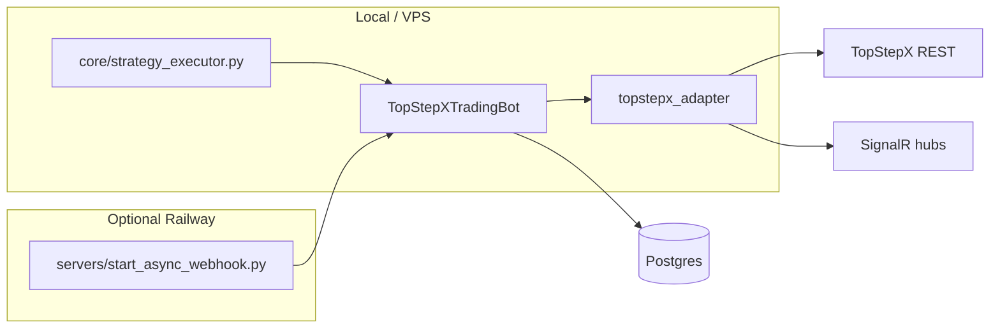

# TopStepX trading bot

Personal / operator-focused futures bot for **TopStepX (ProjectX)** accounts: REST + SignalR, Postgres caching, modular strategies, optional Railway-hosted dashboard.

**Canonical operator docs:** [AGENTS.md](AGENTS.md) → [docs/HANDOFF.md](docs/HANDOFF.md) → [docs/MAP.md](docs/MAP.md) → [docs/PLAYBOOK.md](docs/PLAYBOOK.md). Full topic index: [docs/README.md](docs/README.md).

## Current status

| Area | Status |
|------|--------|
| `trading_bot.py` CLI, `core/strategy_executor.py` | Active |
| `brokers/topstepx_adapter.py`, SignalR market + user hubs | Active |
| Postgres (`infrastructure/database.py`), async batch writers for hot-path telemetry | Active |
| Dashboard / webhook (`servers/start_async_webhook.py` → `async_webhook_server.py`) | Active |
| Strategy configs | `config/strategies/*.toml` + [core/strategy_config.py](core/strategy_config.py) |
| Browser dashboard | Pre-built SPA under `static/dashboard/` (served by aiohttp); no Node stage in Docker |
| Rust hot path (`TOPSTEPX_USE_RUST`) | Partial (few call sites); optional |
| Legacy marketing metrics in old README tables | Removed — treat performance as **environment-specific** |

## How it runs



- **Strategies:** `python core/strategy_executor.py --strategy=<name> --account_id=...` (see [scripts/run_overnight.sh](scripts/run_overnight.sh), [scripts/start_all.sh](scripts/start_all.sh)).
- **Interactive CLI:** `python trading_bot.py` (after `cp .env.example .env` and filling credentials).
- **Dashboard + webhook:** `python servers/start_async_webhook.py` (see [Procfile](Procfile) / [railway.json](railway.json)).

## Configuration

- **Secrets + infra:** `.env` (never commit; use [.env.example](.env.example)).
- **Strategy knobs:** `config/strategies/<strategy>.toml`, not scattered `os.getenv` in strategy code.

Credential resolution order: `PROJECT_X_*` → `TOPSTEPX_*` → legacy typo `TOPSETPX_*`.

## Docker

The [Dockerfile](Dockerfile) is Python-only: installs dependencies, copies the repo, runs `python3 servers/start_async_webhook.py`. The SPA is **pre-built** in `static/dashboard/`; [scripts/build.sh](scripts/build.sh) documents that there is no separate frontend build step.

```bash
docker build -t tradebot-local .
docker run --env-file .env -p 8080:8080 tradebot-local
```

## Tests

Curated quick tests (repo root, venv recommended):

```bash
pytest
```

Full legacy tree (many tests may be stale):

```bash
pytest --override-ini="testpaths=tests"
```

## Strategies (overview)

Built-ins include overnight range, mean reversion, trend following, and others — see [strategies/strategy_manager.py](strategies/strategy_manager.py) and `config/strategies/`. Reference Pine scripts live under [strategies/pine/](strategies/pine/) (not imported by Python).

## Operating notes

- Logs: [core/logging_setup.py](core/logging_setup.py) — file + console; see `LOG_FILE`, `LOG_LEVEL`.
- Risk: global limits in [core/risk_management.py](core/risk_management.py) and per-strategy TOML.
- Perf / uvloop / benches: [docs/perf/README.md](docs/perf/README.md), [docs/CHANGELOG.md](docs/CHANGELOG.md).

## Prospectus

Ongoing work: shrink `trading_bot.py`, deepen tests, optional Rust completion or removal, dashboard real-time transport, doc consolidation under `docs/`.

## Disclaimer

Futures and prop evaluations involve substantial risk. This software is for educational and personal use; you are responsible for compliance, sizing, and losses.
