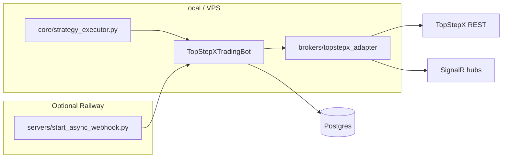

# TopStepX trading bot

Personal / operator-focused futures stack for **TopStepX (ProjectX)** accounts: REST + SignalR, Postgres, modular strategies, optional Railway dashboard.

## Read this first

| Order | Doc |
|--------|-----|
| 1 | [AGENTS.md](AGENTS.md) — golden rules, entrypoints, what not to do |
| 2 | [docs/HANDOFF.md](docs/HANDOFF.md) — lifecycle and mental model |
| 3 | [docs/MAP.md](docs/MAP.md) — annotated module map |
| 4 | [docs/PLAYBOOK.md](docs/PLAYBOOK.md) — start/stop, deploy, triage |

Full topic index: [docs/README.md](docs/README.md).

## Requirements

- **Python** 3.11+ (Dockerfile targets 3.12)
- **PostgreSQL** — `DATABASE_URL` (Railway or local)
- **TopStepX API key + username** — see [.env.example](.env.example)

## Quick start

1. `cp .env.example .env` and set `PROJECT_X_API_KEY`, `PROJECT_X_USERNAME`, `DATABASE_URL`.
2. **Strategy behavior** — edit `config/strategies/<name>.toml`, not long `OVERNIGHT_*` / `TREND_*` blocks in `.env`.
3. **Shrink an existing `.env`** — `python scripts/slim_env.py` keeps only infra keys allowed by that script; anything removed must live in TOML or be added back manually if you truly need it as env.
4. Run strategies: `python core/strategy_executor.py --strategy=<id> --account_id=...` (wrappers: [scripts/run_overnight.sh](scripts/run_overnight.sh), [scripts/start_all.sh](scripts/start_all.sh)).
5. Interactive CLI: `python trading_bot.py`.
6. Dashboard / webhook (e.g. Railway): `python servers/start_async_webhook.py` — see [Procfile](Procfile), [railway.json](railway.json).

## How processes fit together



## Current status

| Area | Status |
|------|--------|
| `trading_bot.py`, `core/strategy_executor.py` | Active |
| `brokers/topstepx_adapter.py`, market + user hubs | Active |
| Postgres + async batch writers | Active |
| Dashboard (`servers/start_async_webhook.py`) | Active |
| Strategy config | `config/strategies/*.toml` + [core/strategy_config.py](core/strategy_config.py) |
| Browser UI | Pre-built SPA in `static/dashboard/` (no Node stage in Docker) |
| Rust hot path (`TOPSTEPX_USE_RUST`) | Optional / partial — profile first; see [docs/perf/OPERATIONS_TUNING.md](docs/perf/OPERATIONS_TUNING.md) |

## Configuration

- **Secrets + infra:** `.env` (never commit). Template: [.env.example](.env.example). Details: [docs/ENV_VARS.md](docs/ENV_VARS.md).
- **Per-strategy knobs:** `config/strategies/<strategy>.toml` — do not add new `os.getenv` in `strategies/*` ([AGENTS.md](AGENTS.md)).
- Credential aliases: `PROJECT_X_*` → `TOPSTEPX_*` → legacy typo `TOPSETPX_*`.

## Docker

[Dockerfile](Dockerfile) installs Python deps and runs `python3 servers/start_async_webhook.py`. The dashboard is **pre-built** under `static/dashboard/` ([scripts/build.sh](scripts/build.sh)).

```bash
docker build -t tradebot-local .
docker run --env-file .env -p 8080:8080 tradebot-local
```

## Tests & hygiene

```bash
pytest
bash scripts/verify_handoff.sh   # doc links + MAP drift
bash scripts/gen_map.sh         # refresh docs/MAP.md after layout changes
```

### Profiling the live hot path (strategy executor)

1. Start the executor, then capture its PID (e.g. `pgrep -f "strategy_executor.py"`).
2. Record ~60s CPU flame graph (requires [py-spy](https://github.com/benfred/py-spy) on the host):

```bash
bash scripts/profile_strategy_executor.sh <PID> 60
```

Output is written under `docs/perf/` (gitignored SVGs are fine to compare locally). Interpretation and Rust-vs-I/O guidance: [docs/perf/OPERATIONS_TUNING.md](docs/perf/OPERATIONS_TUNING.md).

**Verify locally:** with RTH or paper traffic so quotes fire, run the script above, then open the new `.svg` in a browser (flame width = time in stack). User Hub heavy work uses [core/hub_deferred_queue.py](core/hub_deferred_queue.py); the **market** hub still calls `register_quote_callback` targets **synchronously** inside `WebSocketManager.on_quote` (e.g. `trading_bot._on_websocket_quote` → bar aggregator) so tick-to-bar latency stays predictable—that path was intentionally not moved to the deferred queue.

## Security

- Never commit `.env` or tokens. If `.env` was ever shared or committed, **rotate** API keys, DB passwords, JWT, and Discord credentials.
- `scripts/slim_env.py` does not print values; it only rewrites the file.

## Disclaimer

Futures and prop evaluations involve substantial risk. This software is for educational and personal use; you are responsible for compliance, sizing, and losses.
