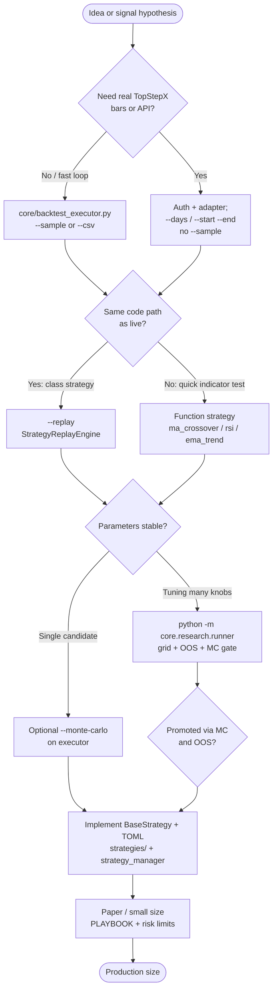

# Strategy development — decision tree

Use this when choosing how to prototype, validate, and ship a strategy. It ties together live code (`strategies/`, `StrategyConfig`), the **single-run** backtest CLI, and the **research** orchestration layer.

## Quick reference — new tooling

| Goal | Command / doc |
|------|-----------------|
| List backtestable strategy names | `python core/backtest_executor.py --list-strategies` |
| One run, human-readable report | `python core/backtest_executor.py --strategy=… --symbol=… --sample --days=30` |
| One run, JSON for CI / scripts | Same + `--format=json` (summary + optional `--monte-carlo=N`) |
| Parameter grid + mandatory OOS + MC gate + optional DB row | `python -m core.research.runner --help` and [BACKTEST_RESEARCH.md](BACKTEST_RESEARCH.md) |
| Short screen then full window (env-driven) | `bash scripts/research_screen.sh` |
| Live hot path / deferral policy | [perf/OPERATIONS_TUNING.md](perf/OPERATIONS_TUNING.md) |

## Decision tree (flow)

### How to read the branches

1. **Data source** — Synthetic sample and CSV are offline-safe. API history needs credentials; keep `ENABLE_SIGNALR=false` when you only need REST history (see [BACKTESTING.md](BACKTESTING.md)).
2. **Parity with live** — Anything under `strategies/*Strategy` that uses `trading_bot` APIs should be validated with **`--replay`** once bars exist. Indicator-only experiments can stay on function strategies first (faster iteration).
3. **Many parameters** — Use **`core.research.runner`** so you do not skip OOS or MC by hand. Cap grid size (`--max-grid`); store provenance with `--toml` + `--run-tag`.
4. **Ship** — TOML + `StrategyConfig` only (no `os.getenv` in strategies). Follow [STRATEGIES.md](STRATEGIES.md) and [CONVENTIONS.md](CONVENTIONS.md).

## Anti-patterns (short)

- Optimizing only on in-sample bars with no OOS block.
- Grid search without recording `git_sha` / config hash (research runner does this when DB persist succeeds).
- Moving quote handlers to the deferred queue for latency-sensitive paths (see OPERATIONS_TUNING).

## Promotion gate — walk-forward (BONGO Tier 2L)

Before a strategy id moves from **research / idea** to **live** in `docs/perf/sweeps/CANDIDATES.md` (or any internal promotion list), run at least one **walk-forward** pass with `python -m core.research.runner --walk-forward <FOLDS> …` where **`<FOLDS>` ≥ 2** (see [BACKTEST_RESEARCH.md](BACKTEST_RESEARCH.md) for flags, grid caps, and persistence). Single-window IS-only grids are allowed for screening; **graduation** requires walk-forward (or equivalent documented time-split evidence) so curve-fit parameter islands do not ship on production accounts.

## Related docs

- [BACKTESTING.md](BACKTESTING.md) — executor flags, env, CSV/replay.
- [BACKTEST_RESEARCH.md](BACKTEST_RESEARCH.md) — research runner semantics.
- [DECISIONS.md](DECISIONS.md) — ADRs for past architecture choices.
